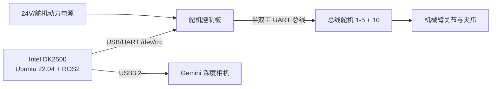
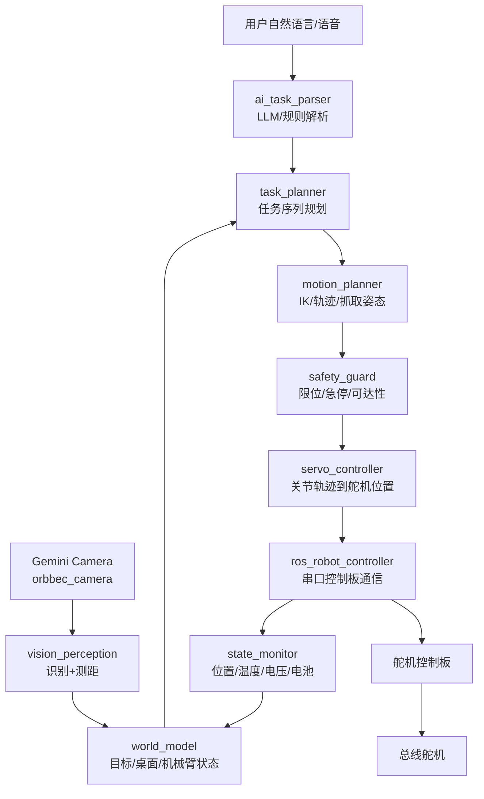

# AI 视觉自然语言机械臂项目架构规划

> 项目硬件：Gemini 深度相机、Intel DK2500 开发板、总线舵机机械臂、舵机控制板。  
> 项目目标：识别外界物块并测距，接收自然语言任务，在 DK2500 上完成 AI 理解、视觉感知、运动规划，并通过总线舵机控制链路驱动机械臂运动。

## 1. 平台理解

从用户提供图片看，机械臂为绿色金属结构、多关节串联机械臂，关节处为总线舵机，底部有舵机控制板，末端附近可安装 Gemini 深度相机或末端执行器。项目应按“桌面固定机械臂 + 眼在手外或眼在手上 RGB-D 相机 + 总线舵机闭环/半闭环控制”的形式规划。

本工作区已有可复用资料和源码：

| 模块 | 已有资料/源码 |
|---|---|
| ROS2 Gemini 相机 | `gemini深度相机/ROS2/`、`3.源码资料/ROS2/src/peripherals/launch/include/gemini.launch.py` |
| ROS2 深度相机统一启动 | `3.源码资料/ROS2/src/peripherals/launch/depth_camera.launch.py` |
| RGB-D 智能抓取示例 | `3.源码资料/ROS2/src/large_models_examples/large_models_examples/intelligent_grasp.py` |
| 自然语言控制舵机示例 | `3.源码资料/ROS2/src/large_models_examples/large_models_examples/llm_control_servo.py` |
| 舵机控制链路 | `3.源码资料/ROS2/src/driver/servo_controller/`、`3.源码资料/ROS2/src/driver/ros_robot_controller/` |
| 逆运动学服务 | `3.源码资料/ROS2/src/driver/kinematics/` |
| DK2500 资料 | `4.硬件资料/1 ROS主控资料/1.开发板相关课程/3.Intel DK2500开发板资料/inteldk2500.pdf` |
| 总线舵机协议 | `4.硬件资料/3 总线舵机资料/02 总线舵机通信协议.pdf` |

## 2. 总体功能清单

| 功能 | 输入 | 输出 | 实现途径 |
|---|---|---|---|
| 系统启动与自检 | DK2500、电源、串口、相机 | 节点状态、设备状态 | ROS2 bringup、udev 固定设备名、舵机 ID 检测、相机话题检测 |
| Gemini 图像采集 | USB3.2 RGB-D 数据 | RGB、Depth、CameraInfo、点云 | OrbbecSDK ROS2，`depth_camera.launch.py` 加载 Gemini |
| 图像同步 | RGB、Depth、CameraInfo | 时间同步后的帧组 | `message_filters.ApproximateTimeSynchronizer` |
| 物块识别 | RGB 图像、自然语言目标 | 目标类别、框、掩码、置信度 | OpenCV 基线、YOLO/OpenVINO、或多模态视觉模型 |
| 测距与三维定位 | 检测框、深度图、相机内参 | 目标相机坐标/机械臂坐标 | 深度 ROI 过滤、像素反投影、手眼标定、桌面平面约束 |
| 抓取姿态估计 | 目标掩码、深度、夹爪模型 | 抓取点、夹爪角度、预抓取点 | 最小外接矩形、主轴方向、深度边缘、夹爪宽度估计 |
| 自然语言理解 | 文本/语音输入 | 结构化任务 JSON | 大模型 Agent，函数调用/JSON schema，安全约束提示词 |
| 任务规划 | 结构化任务、感知结果 | 任务序列 | `observe -> select -> plan_grasp -> move -> grip -> place -> verify` |
| 运动规划 | 目标位姿、关节状态 | 关节轨迹/脉宽目标 | 现有 `kinematics` 服务，后续可接 MoveIt2 做碰撞规划 |
| 舵机控制 | 关节轨迹、夹爪命令 | 总线舵机动作 | `servo_controller` -> `ros_robot_controller` -> 控制板 -> 总线舵机 |
| 状态反馈 | 舵机位置、温度、电压、电池、相机状态 | 运行状态、报警 | 读取舵机状态、ROS diagnostics、日志和 UI |
| 安全保护 | 限位、急停、异常识别 | 停止/降级/报警 | 软件限位、碰撞区域、看门狗、人工急停 |

## 3. 实现路径

### 3.1 计算平台：Intel DK2500

DK2500 作为主控计算节点。根据本地 `inteldk2500.pdf`，该板具备 Intel Core Ultra 5 225U、16GB DDR5、128GB SSD、4 路 USB3.2、4 路 GbE、24V DC-in，并支持 Ubuntu 20.04/22.04。

建议环境：

| 项目 | 建议 |
|---|---|
| 系统 | Ubuntu 22.04 |
| ROS2 | Humble |
| 相机 | OrbbecSDK ROS2 |
| AI 推理 | 先使用云端/局域网 LLM API；本地视觉模型可用 OpenCV/YOLO/OpenVINO |
| 串口 | 使用 udev 规则固定为 `/dev/rrc` 或 `/dev/jetarm_controller` |
| 部署 | DK2500 上统一运行 ROS2 workspace，必要时用 systemd 管理启动 |

### 3.2 Gemini 深度相机

使用本地 OrbbecSDK ROS2 资料和现有 `peripherals` 包。

关键配置：

| 配置 | 建议 |
|---|---|
| 相机名 | `depth_cam` |
| RGB | 640x480，30 或 60 FPS |
| Depth | 640x400，30 FPS |
| 点云 | 调试时开启，正式抓取可按需关闭 |
| 深度对齐 | 需要彩色点云或 RGB 框直接取深度时开启 `depth_registration` |
| DDS | 若图像延迟/丢帧，按 Orbbec README 调整 CycloneDDS 和 UDP 缓冲区 |

现有话题契约：

| 话题 | 说明 |
|---|---|
| `/depth_cam/rgb/image_raw` | RGB 图像 |
| `/depth_cam/depth/image_raw` | 深度图 |
| `/depth_cam/rgb/camera_info` | RGB 内参 |
| `/depth_cam/depth/camera_info` | 深度内参 |

### 3.3 视觉识别与测距

第一版用稳定、可解释的方案：

1. RGB 图像做 ROI 裁剪，减少背景干扰。
2. 颜色/形状物块先用 OpenCV 阈值、轮廓、最小外接矩形识别。
3. 根据检测框或掩码，从深度图取中位深度或鲁棒最小深度。
4. 使用相机内参把像素点 `(u, v, z)` 反投影到相机坐标。
5. 通过手眼标定矩阵转换到机械臂基坐标。
6. 输出 `object_id、label、bbox、center_3d、grasp_yaw、width、confidence`。

第二版再接 AI 视觉：

1. 对常见物块训练 YOLO/检测模型，DK2500 上可评估 OpenVINO 加速。
2. 自然语言指定目标时，先由 LLM 解析目标属性，再传给检测模型。
3. 对复杂目标使用视觉语言模型做候选目标选择，但最终抓取点仍用几何/深度算法确认。

### 3.4 自然语言与任务规划

自然语言不应直接控制舵机字节帧。推荐链路：

`用户输入 -> LLM 解析 -> 结构化任务 -> 安全校验 -> 任务规划 -> 运动规划 -> 舵机控制`

结构化输出示例：

```json
{
  "intent": "pick_and_place",
  "target": {
    "name": "red_block",
    "attributes": ["red", "cube"]
  },
  "destination": {
    "type": "zone",
    "name": "left_box"
  },
  "constraints": {
    "speed": "slow",
    "confirm_before_execute": true
  }
}
```

必须避免 `eval()` 执行动作字符串。现有 `llm_control_servo.py` 可作为教学示例，但工程化版本应改为 JSON schema + 函数白名单 + 参数范围检查。

### 3.5 运动规划

第一阶段沿用现有 `kinematics` 服务：

| 服务 | 用途 |
|---|---|
| `kinematics/set_joint_value_target` | 给定关节脉宽/角度，计算末端位姿 |
| `kinematics/set_pose_target` | 给定末端目标位姿，求解舵机脉宽 |

运动序列建议：

1. `home`：回安全初始位。
2. `observe`：相机拍摄并识别目标。
3. `pre_grasp`：移动到目标上方。
4. `descend`：下降到抓取高度。
5. `close_gripper`：闭合夹爪。
6. `lift`：抬升。
7. `place_pre`：移动到放置区上方。
8. `place`：下降放置。
9. `open_gripper`：释放。
10. `verify`：视觉确认。

第二阶段引入 MoveIt2 或自定义碰撞检查：

1. 加入 URDF/Xacro、关节限位、碰撞体。
2. 对桌面、相机支架、机械臂自身建立简化碰撞模型。
3. 对 AI 给出的目标点做可达性、碰撞、奇异位姿检查。

### 3.6 总线舵机控制

通信分两层：

| 层 | 协议 | 说明 |
|---|---|---|
| DK2500 到控制板 | `0xAA 0x55 Function Length Data CRC8` | 当前 ROS2 `ros_robot_controller_sdk.py` 已实现 |
| 控制板到总线舵机 | `0x55 0x55 ID Length Cmd Params Checksum` | 参考 `02 总线舵机通信协议.pdf` |

总线舵机协议已确认要点：

1. 半双工 UART，波特率 115200 bps。
2. 舵机 ID 范围 0-253，广播 ID 为 254。
3. `SERVO_MOVE_TIME_WRITE` 指令值为 1，位置范围 0-1000，对应 0-240 度。
4. 可读取 ID、位置、温度、电压、角度限制、电压限制、扭矩状态等。
5. 写动作时要等待上一条动作完成，否则旧动作会被打断。

工程建议：

1. 保持 `servo_controller` 作为上层唯一舵机命令入口。
2. `ros_robot_controller` 负责串口协议和底层控制板通信。
3. 不让 AI、视觉或任务规划节点直接写舵机底层协议。
4. 增加 `safety_guard` 节点：限制位置、速度、抓取高度、工作空间。

## 4. 系统结构安排

### 4.1 硬件结构



### 4.2 ROS2 软件结构



### 4.3 建议包结构

```text
ai_vision_arm_ws/src/
  ai_vision_arm_bringup/
    launch/ai_vision_arm.launch.py
    config/devices.yaml
  ai_vision_arm_perception/
    nodes/rgbd_sync_node.py
    nodes/object_detector_node.py
    nodes/depth_localizer_node.py
    config/camera.yaml
    config/hand_eye.yaml
  ai_vision_arm_task/
    nodes/ai_task_parser_node.py
    nodes/task_planner_node.py
    prompts/
  ai_vision_arm_motion/
    nodes/grasp_planner_node.py
    nodes/motion_executor_node.py
    config/workspace.yaml
  ai_vision_arm_safety/
    nodes/safety_guard_node.py
    config/limits.yaml
  ai_vision_arm_msgs/
    msg/DetectedObject.msg
    msg/SceneObject.msg
    msg/TaskPlan.msg
    srv/ParseTask.srv
    action/PickPlace.action
```

### 4.4 数据接口建议

| 接口 | 类型 | 内容 |
|---|---|---|
| `/perception/detected_objects` | topic | 目标类别、bbox、3D 坐标、抓取角、置信度 |
| `/world_model/scene` | topic | 当前场景对象、桌面平面、机械臂状态 |
| `/task/parse` | service | 自然语言到结构化任务 |
| `/task/plan` | service | 结构化任务到步骤序列 |
| `/motion/pick_place` | action | 抓取/放置动作执行 |
| `/safety/state` | topic | 急停、限位、温度、电压、错误状态 |
| `/servo_controller` | topic | 现有舵机位置控制接口 |

## 5. 分步开发策略

### 阶段 0：资料与硬件确认

目标：形成硬件台账和资料闭环。

任务：

1. 确认 DK2500 型号、电源、Ubuntu 版本。
2. 确认 Gemini 型号、USB 线、安装姿态。
3. 确认舵机数量、ID、关节方向、零位、限位。
4. 确认控制板和 DK2500 的连接方式，固定串口名。
5. 建立项目目录和资料索引。

验收：

1. `9.项目架构规划/` 文档齐全。
2. DK2500、Gemini、总线舵机资料能在目录中找到。

### 阶段 1：DK2500 ROS2 基础环境

目标：DK2500 能运行现有 ROS2 工程。

任务：

1. 安装 Ubuntu 22.04 和 ROS2 Humble。
2. 配置 `ros2_ws`、依赖、环境变量。
3. 设置 `CAMERA_TYPE=GEMINI`、`need_compile`、`ASR_LANGUAGE` 等运行变量。
4. 固定串口设备，如 `/dev/rrc`。

验收：

1. `ros2 topic list` 正常。
2. `ros2 launch bringup bringup.launch.py` 能加载基础节点。
3. 无相机和舵机时也能给出清晰错误。

### 阶段 2：Gemini 相机跑通

目标：稳定获得 RGB-D 数据。

任务：

1. 编译 OrbbecSDK ROS2。
2. 安装 udev rules。
3. 运行 `depth_camera.launch.py`。
4. 在 RViz2 查看 RGB、Depth、PointCloud。
5. 调整分辨率、帧率、DDS 参数。

验收：

1. `/depth_cam/rgb/image_raw`、`/depth_cam/depth/image_raw` 持续发布。
2. 深度图在目标区域无明显大面积空洞。
3. RGB 和 Depth 可同步。

### 阶段 3：舵机控制链路跑通

目标：DK2500 能控制机械臂回零和单关节动作。

任务：

1. 运行 `ros_robot_controller`。
2. 检查 `/dev/rrc` 串口。
3. 运行 `servo_controller` 和 `kinematics`。
4. 读取舵机 ID、位置、温度、电压。
5. 建立安全限位和初始姿态。

验收：

1. 舵机 ID 1-5 和 10 可识别。
2. 单关节小幅动作可控。
3. 急停/停止命令有效。

### 阶段 4：标定与坐标系统

目标：把相机坐标转换到机械臂基坐标。

任务：

1. 确定相机安装方式：眼在手上或眼在手外。
2. 标定 RGB/Depth 内参和外参。
3. 标定桌面平面。
4. 写入 `transform.yaml`、`calibration.yaml`。
5. 用已知物块坐标验证误差。

验收：

1. 物块 3D 坐标误差小于项目设定阈值。
2. 机械臂预抓取点能移动到目标上方。

### 阶段 5：物块识别与测距

目标：从 RGB-D 中输出可抓取目标。

任务：

1. OpenCV 识别颜色块/形状块。
2. 深度 ROI 滤波，计算目标中心和抓取角。
3. 输出统一 `DetectedObject`。
4. 做可视化窗口或 RViz marker。

验收：

1. 识别稳定，误检可控。
2. 目标中心、深度和抓取角可重复。

### 阶段 6：固定指令抓取

目标：不接 AI，先完成规则式抓取。

任务：

1. 固定抓取红色/蓝色物块。
2. 生成预抓取、下降、闭合、抬升、放置动作。
3. 引入失败恢复：目标丢失、不可达、夹取失败。

验收：

1. 单物块抓取成功率达到可演示水平。
2. 失败时机械臂能回安全位。

### 阶段 7：自然语言任务接入

目标：自然语言选择目标和动作。

任务：

1. 设计 JSON schema 和函数白名单。
2. 将 LLM 输出限制为任务描述，不直接输出 Python 代码或舵机命令。
3. 连接 `task_planner` 和 `motion_executor`。
4. 支持“抓红色方块放到左边”等命令。

验收：

1. LLM 输出格式稳定。
2. 越界/危险命令被拒绝。
3. 语言目标能正确匹配视觉目标。

### 阶段 8：运动规划增强

目标：提高可达性、避障和轨迹质量。

任务：

1. 建立 URDF/Xacro 和关节限位。
2. 加入碰撞体：桌面、相机、底座、放置区。
3. 接入 MoveIt2 或自定义碰撞检查。
4. 对轨迹做速度/加速度约束。

验收：

1. 轨迹平滑，无明显撞击风险。
2. 复杂摆放场景下能选择安全路径。

### 阶段 9：系统联调与演示

目标：形成完整演示。

任务：

1. 一键启动 `ai_vision_arm.launch.py`。
2. 记录日志、话题、视频。
3. 做 20-50 次抓取统计。
4. 输出故障清单和下一轮优化计划。

验收：

1. 可完成“自然语言指定目标 -> 识别测距 -> 抓取 -> 放置 -> 反馈”的闭环。
2. 所有异常有清晰状态和恢复动作。

## 6. 关键风险与处理

| 风险 | 表现 | 处理 |
|---|---|---|
| 深度相机 USB 带宽/供电不足 | 丢帧、无图、启动失败 | 使用 USB3.2 直连或供电 Hub，降低分辨率 |
| RGB 与深度未对齐 | 框内深度不准 | 开启深度对齐或使用正确 TF/内参投影 |
| 手眼标定误差 | 抓取点偏移 | 做标定板/桌面平面校准，加入偏移补偿 |
| 舵机 ID/方向不一致 | 关节动作反向或撞限位 | 建立舵机 ID 表、零位表、方向表 |
| LLM 输出不可控 | 生成危险动作 | JSON schema、白名单、参数限幅、人工确认 |
| 动力供电不足 | 舵机抖动、复位 | 单独舵机电源，满足峰值电流，共地 |
| 串口设备名变化 | 节点启动失败 | udev 固定 `/dev/rrc` |
| 机械结构碰撞 | 夹爪/臂体撞桌面 | 工作空间限制、预抓取高度、碰撞模型 |

## 7. 最小可运行闭环

第一版最小系统建议只做以下闭环：

1. DK2500 启动 ROS2。
2. Gemini 发布 RGB-D。
3. OpenCV 识别指定颜色物块。
4. 深度图计算目标三维位置。
5. `kinematics/set_pose_target` 求解舵机位置。
6. `servo_controller` 发布舵机位置。
7. `ros_robot_controller` 经控制板驱动总线舵机。
8. 机械臂抓取并放到固定放置区。

自然语言和复杂规划应在这个闭环稳定后再接入。这样每一层都有可验证的输入输出，调试压力会小很多。

