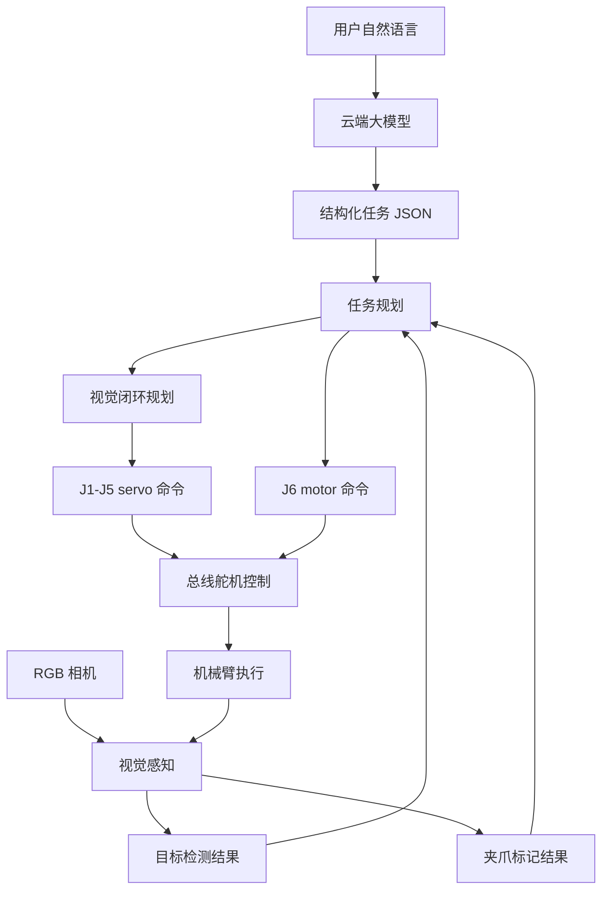

# AI 视觉自然语言机械臂项目架构规划

> 项目硬件：RGB 相机、Intel DK2500/主机、总线舵机机械臂、舵机控制板。  
> 项目目标：通过 RGB 彩色图识别外界物块和夹爪标记，接收自然语言任务，完成 AI 理解、视觉闭环运动规划，并通过总线舵机控制链路驱动机械臂运动。

## 1. 当前执行路线

```text
用户自然语言
-> 云端大模型解析任务和目标
-> 本地读取 RGB 彩色图
-> 检测目标和夹爪橙色爪尖
-> 通过图像误差闭环调整 J1-J5
-> J6 使用 motor 模式夹取/释放
-> 完成任务后回 home
```

home 位置：

```text
J1=485, J2=478, J3=641, J4=890, J5=500；J6 保持当前状态，home 时不发 J6 信号
```

## 2. 功能清单

| 功能 | 输入 | 输出 | 实现途径 |
|---|---|---|---|
| 系统启动与自检 | 电源、串口、相机 | 节点状态、设备状态 | ROS2 bringup、舵机 ID 检测、相机话题检测 |
| RGB 图像采集 | 彩色相机数据 | RGB 图像 | 本地相机读取节点 |
| 夹爪标记检测 | RGB 图像 | 两侧橙色爪尖、夹爪中心线 | HSV 阈值、轮廓检测、几何校验 |
| 目标检测 | RGB 图像、自然语言目标 | 目标类别、框、掩码、置信度 | 本地检测 + 云端大模型结构化结果 |
| 自然语言理解 | 文本输入 | 结构化任务 JSON | 云端大模型、JSON schema、白名单动作 |
| 任务规划 | 结构化任务、感知结果 | 任务序列 | `observe -> align -> grasp -> place -> verify -> home` |
| 视觉闭环规划 | 目标像素、夹爪像素 | J1-J5 小步动作 | 像素误差、视觉伺服雅可比、限位检查 |
| J6 抓取控制 | 抓取/释放命令、J6 位置反馈 | 夹取状态 | motor 速度控制、2 秒位置不变判定、夹紧速度提升 |
| 状态反馈 | 舵机位置、温度、电压、相机状态 | 运行状态、报警 | 状态读取、日志、异常停止 |
| 安全保护 | 限位、桌面高度、异常识别 | 停止/降级/报警 | 软件限位、工作空间约束、回 home |

## 3. 系统结构



## 4. ROS2 节点规划

| 节点 | 作用 |
|---|---|
| `rgb_camera_node` | 发布 RGB 图像 |
| `gripper_marker_detector` | 检测橙色爪尖和夹爪中心线 |
| `object_detector` | 检测目标物体、放置区域和叠放对象 |
| `llm_task_parser` | 调用云端大模型并输出结构化任务 JSON |
| `visual_servo_planner` | 根据像素误差生成 J1-J5 小步动作 |
| `jetarm_controller` | 封装总线舵机控制，执行 servo/motor 命令 |
| `task_executor` | 串联观察、对准、夹取、移动、释放、回 home |
| `safety_guard` | 检查关节限位、工作空间、异常状态 |

## 5. 数据接口

### 5.1 目标检测结果

```json
{
  "objects": [
    {
      "id": "obj_1",
      "label": "red_block",
      "color": "red",
      "bbox_xyxy": [120, 90, 180, 150],
      "center_uv": [150, 120],
      "confidence": 0.93
    }
  ]
}
```

### 5.2 夹爪检测结果

```json
{
  "left_tip_uv": [210, 380],
  "right_tip_uv": [430, 382],
  "center_uv": [320, 381],
  "centerline_angle_deg": 0.5,
  "confidence": 0.91
}
```

### 5.3 任务 JSON

```json
{
  "task_type": "pick_place",
  "target": {
    "description": "red block",
    "color": "red",
    "object_type": "block"
  },
  "destination": {
    "description": "blue box",
    "color": "blue",
    "object_type": "box"
  },
  "steps": [
    "observe",
    "align_gripper_to_target",
    "grasp",
    "align_gripper_to_destination",
    "release",
    "return_home"
  ]
}
```

## 6. 安全约束

- J1-J5 只能执行限位内的 servo 命令。
- J6 只能按当前抓取策略执行 motor 命令。
- 桌面高度定义为 `z=0`。
- 目标丢失、夹爪标记丢失、舵机状态不可读时停止。
- 每次任务完成后回 home。
